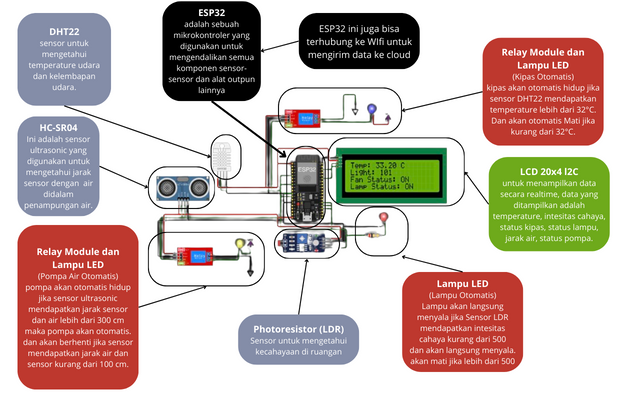

# Green House

### Ardi Fajar Arifin - 10122266

## Link Project :
- Wokwi         : <a href='https://wokwi.com/projects/386816792253478913'>Link Wokwi</a>
- Thingspeak    : <a href='https://thingspeak.com/channels/2401597'>Link Thingspeak</a>

### Alasan Memilih Ide ini :

Alasan saya mengambil Tema Green House adalah karena saya tertarik pada tema green house ini, karena saya tumbuh dari keluarga petani juga jadi saya pengen berkecimpung dengan pertanian meskipun sedikit dan ditambahkan dengan ilmu IoT agar bisa melakukan pertanian dengan serba otomatis. Data yang diambil terus dikirim ke cloud (thingspeak) akan dianalisis agar dapat meningkatkan pertanian.

### Perangkat yang digunakan :

- ESP32
- 2 x Module Relay
- 3 x lampu LED
- Sensor DHT22
- Sensor HC-SR04
- Sensor LDR

### Skematik :

